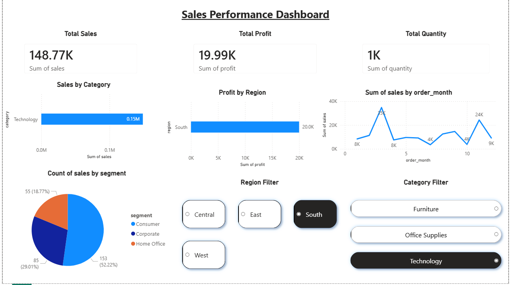

# 📊 Sales Performance Dashboard (Power BI)

## 🚀 Project Overview

This project presents an interactive Sales Dashboard built using Power BI to analyze business performance across different regions, categories, and customer segments.

## 📌 Key Features

* 📈 Monthly Sales Trend Analysis
* 📊 Sales by Category
* 🌍 Profit by Region
* 🧑‍🤝‍🧑 Customer Segment Distribution
* 🎯 Interactive Filters (Region & Category)

## 🛠️ Tools Used

* Power BI
* Data Visualization
* Basic DAX

## 📷 Dashboard Preview

## 📊 Key Insights

* Technology category contributes highest sales
* Sales peak observed around Month 10
* Strong performance from South/West regions
* Consumer segment dominates overall sales

## 📁 Files Included

* `sales_dashboard.pbix`
* `Sales_Dashboard.pdf`
* `dashboard_preview.png`

## 🔗 Dataset Source

Cleaned using my previous project:
👉 https://github.com/Purandareswar/superstore-data-cleaning

## 💡 Learnings

* Built interactive dashboards using Power BI
* Applied data storytelling techniques
* Learned filtering and visualization best practices

## 📬 Connect with Me

www.linkedin.com/in/t-reddy-purandareswar-a7321a280
